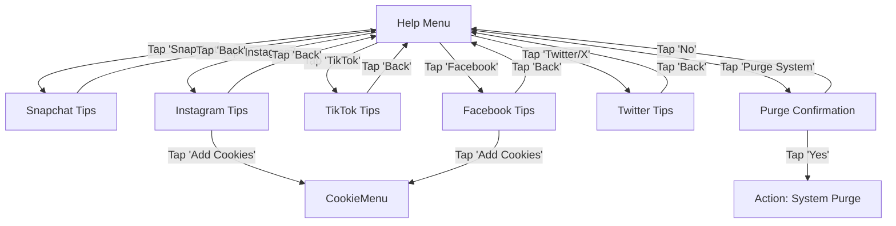
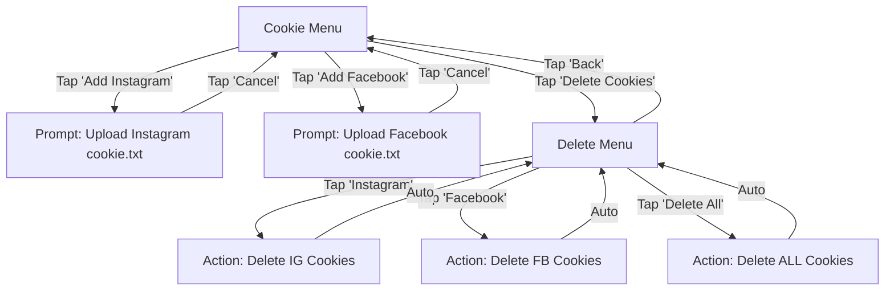

# StoryFlow Bot Command & Interaction Guide

This document maps the interactive flows of the StoryFlow Telegram bot. All future updates to commands or menus must maintain these fluid transitions to ensure a high-quality user experience.

## 🌟 Core Philosophy
- **Fluid Navigation**: Every menu should have a way to go back or return to the main menu.
- **Visual Feedback**: Use emojis and clear status messages to indicate state (Processing, Downloading, Uploading).
- **Interactive**: Prefer button taps over typing commands where possible.

## 🎮 Command Structure

| Command | Description | Flow |
|---------|-------------|------|
| `/start` | Initializes the bot interaction | -> **Main Menu** |
| `/help` | Shows usage guide | -> **Help Menu** |
| `/my_cookies` | Manages authentication cookies | -> **Cookie Menu** |
| `/upload_cookies` | Shortcut to upload cookies | -> **Cookie Menu** |
| `/delete_cookies` | Shortcut to delete cookies | -> **Delete Confirmation** |
| `/purge` | (Admin) Cleaning tool | -> **System Message** (No menu) |

## 🔀 Interaction Flows

### 1. Main Menu Flow (`/start`)
The central hub of the application.
```mermaid
graph TD
    Start[/start] --> MainMenu
    MainMenu[Main Menu]
    
    MainMenu -->|Tap 'How to Use'| HelpMenu
    MainMenu -->|Tap 'Manage Cookies'| CookieMenu
    MainMenu -->|Tap 'My Stats'| StatsView
    
    HelpMenu -->|Tap 'Back'| MainMenu
    CookieMenu -->|Tap 'Main Menu'| MainMenu
    StatsView -->|Tap 'Main Menu'| MainMenu
```

### 2. Help Menu Flow (`/help` or via Menu)
Context-aware help with platform specifics.


### 3. Cookie Management Flow
Secure handling of authentication files.


### 4. Download Flow (URL Input)
Automatic handling of media links.
```mermaid
graph TD
    UserLink[User sends URL] --> Analyze{Identify Platform}
    
    Analyze -->|Unknown| ErrorMsg[Show Error & Supported Platforms]
    Analyze -->|Supported| Processing[Status: 'Analzying...']
    
    Processing --> Queue{Job Queue}
    
    Queue -->|Wait| StatusQueued[Status: 'Queued (Pos X)...']
    Queue -->|Start| StatusDown[Status: 'Downloading...']
    
    StatusDown -->|Success| Uploading[Status: 'Sending Files...']
    StatusDown -->|Fail| FailureMsg[Detail Error Message]
    
    Uploading -->|Complete| FinalMsg[✅ Delivery Complete]
```

## ⚠️ Maintenance Guidelines
1. **Never break the chain**: Ensure every new menu has a "Back" button pointing to its logical parent.
2. **Consistent Style**: Use established emojis for platforms (👻, 📸, 🎵, 🐦, 📘).
3. **Error Handling**: If an action fails, provide a button to retry or return to the main menu.
